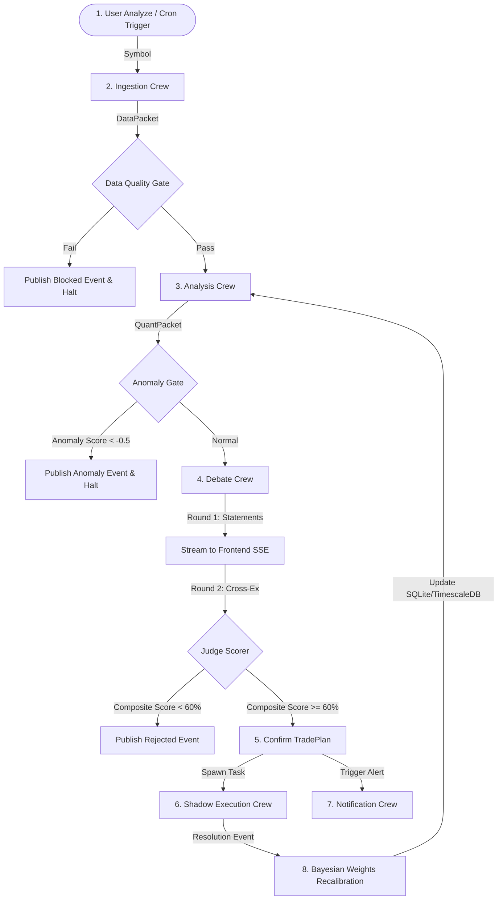

# TITAN v2.0 — Production-Grade AI Trading Intelligence System
### Zero-Budget Path From First Commit To Live Investor Demo

---

## WHAT TITAN IS

TITAN is an **autonomous trading intelligence platform** that combines:

1. **Quantitative & Statistical Modeling** — regime detection, mean-reversion tests, cointegration, fractal analysis
2. **Machine Learning** — Hidden Markov Models for regime states, gradient-boosted signal scoring, anomaly detection
3. **Massive Data Cleaning** — multi-source ingestion with staleness detection, outlier filtering, gap filling, normalization
4. **High Diversification** — asset-class-adaptive indicator clusters that eliminate correlation bias
5. **AI Agent Adversarial Debate** — Bull vs Bear vs Judge structured debate with quantitative evidence, streamed live
6. **Automated Paper Trading** — every signal shadow-traded, outcome-tracked, fed back into weight calibration
7. **Self-Learning Bayesian Engine** — weights recalibrate from real outcomes, decaying setups auto-retire

An investor opens a link, picks any asset, watches the full pipeline run live — and receives a real notification days later when the paper trade resolves. That delayed proof is what raises money.

---

## CORE DESIGN DECISIONS (v2.0 Changes From v1.0)

| Decision | v1.0 (Old) | v2.0 (New) | Why |
|----------|-----------|-----------|-----|
| Agent framework | LangGraph + AutoGen + CrewAI | **LangGraph only** | One state model, one memory system, no integration bugs |
| Default LLM | BYOK only (user pays) | **Gemini 2.0 Flash free tier** (1M tokens/day) | Truly $0 for demo, BYOK as upgrade |
| Backtesting engine | QuantConnect LEAN (.NET) | **vectorbt** (pure Python, NumPy) | 100x faster, no .NET dependency, same math |
| Shadow trader | Freqtrade (full bot framework) | **Custom PaperTradeTracker** (~200 lines) | We only need log + check + resolve |
| Database | PostgreSQL + TimescaleDB + Redis | **SQLite + Redis** | Zero ops, single-file DB, Redis for pub/sub only |
| Indicators | 10-14 individual indicators | **5 independent signal clusters** | Eliminates correlation bias (EMA/MACD/BB all measure the same thing) |
| News data | NewsAPI (100 req/day limit) | **RSS feeds** (Reuters, CoinDesk, unlimited) | No rate limits, no API key, truly free |
| Notifications | PWA Push only (~60% permission rate) | **Email primary** (Resend 100/day free) + PWA push secondary | 95%+ delivery |
| Deployment | Railway (sleeps after 30min) | **Fly.io** (256MB always-on) + UptimeRobot keepalive | No cold start for investor demo |
| MVP scope | All asset classes at once | **BTC/USD vertical first** → expand to ETH, forex, equities | Ship real in 30 days, not 56 |
| Confidence weights | Arbitrary (0.30/0.40/0.30) | **Equal start → Bayesian-learned** | No made-up numbers, empirically derived |
| Backtest validation | In-sample only (overfit risk) | **Walk-forward + 15% haircut** | Honest performance numbers |

---

## COMPLETE TECH STACK

```
FRONTEND
├── Next.js 14 (App Router + TypeScript)
├── TradingView Lightweight Charts v4
├── Vanilla CSS + shadcn/ui (clean, institutional design)
├── Server-Sent Events (streaming pipeline status + debate text)
└── Service Worker (PWA push notifications — secondary channel)

BACKEND GATEWAY
├── FastAPI (Python 3.12)
├── SSE endpoint (real-time frontend streaming)
├── BYOK router (Gemini default, OpenAI/Anthropic optional)
├── JWT auth (simple email + password)
└── Rate limiter (per-user, per-endpoint)

AGENT LAYER (LangGraph only)
├── StateGraph pipeline (data → regime → indicators → gate → debate → score → output)
├── Bull Agent node (structured JSON arguments)
├── Bear Agent node (structured JSON counterarguments)
├── Judge Agent node (deterministic scoring from structured data)
├── Human-readable debate renderer (converts JSON → readable text for frontend)
└── Gemini 2.0 Flash (default, free) / BYOK (upgrade path)

QUANT ENGINE
├── Regime Detector
│   ├── Hurst Exponent (rescaled range, 100-bar rolling)
│   ├── ADX (trend strength, all timeframes)
│   ├── ATR Percentile (252-day rank, volatility regime)
│   └── Regime Stability Score (transition detection)
├── 5 Independent Signal Clusters
│   ├── TREND cluster (EMA cross OR MACD — one representative)
│   ├── MOMENTUM cluster (RSI OR Stochastic — one representative)
│   ├── VOLATILITY cluster (Bollinger Band position OR ATR breakout)
│   ├── VOLUME cluster (VWAP deviation OR OBV trend)
│   └── SENTIMENT cluster (social score OR funding rate)
├── Statistical Models
│   ├── Z-score of price vs rolling mean
│   ├── Return autocorrelation (mean-reversion signal)
│   ├── Hurst Exponent trend/MR classification
│   └── Fractal Dimension (Higuchi method — complexity measure)
├── Machine Learning Models
│   ├── Hidden Markov Model (3-state regime classifier, hmmlearn)
│   ├── LightGBM signal scorer (features: all indicators + regime + sentiment)
│   ├── Isolation Forest anomaly detector (unusual market conditions → reduce confidence)
│   └── Walk-Forward Validator (train/test split, prevents overfitting)
├── vectorbt Backtester
│   ├── Runs indicator combination on historical data
│   ├── Extracts: win rate, avg win/loss, Sharpe, max DD, profit factor
│   ├── Applies 15% performance haircut (backtest → live degradation)
│   └── Minimum 200 instances required for statistical significance
└── Confidence Scorer
    ├── Cluster consensus (X/5 clusters agree)
    ├── Regime clarity × stability
    ├── ML model agreement score
    ├── Backtest-validated expected edge
    └── Composite: equal-weighted start → Bayesian-learned weights after 100 trades

DATA PIPELINE
├── Market Data
│   ├── CCXT (crypto: Binance, Bybit — no API key for public data)
│   ├── yfinance (equities, forex, commodities — no API key)
│   └── FRED API (macro: interest rates, CPI, unemployment — free, unlimited)
├── News & Sentiment
│   ├── RSS feeds (Reuters, CoinDesk, Bloomberg RSS — unlimited, no key)
│   ├── feedparser (Python RSS parser)
│   ├── VADER sentiment scorer (NLTK, runs locally, no API)
│   └── Reddit PRAW (free, rate-limited but sufficient)
├── Crypto-Specific
│   ├── CCXT: funding rate, open interest, liquidations
│   ├── CoinGecko free tier: market cap, volume, developer activity
│   └── DeFiLlama (free, no key): TVL, protocol revenue
├── Data Quality Gate
│   ├── Staleness detector (reject data older than 5 minutes)
│   ├── Completeness checker (>98% non-null required)
│   ├── Outlier filter (Z-score > 4 flagged, > 6 rejected)
│   ├── Gap filler (forward-fill for gaps < 5 candles, reject longer gaps)
│   └── Cross-source validator (if 2 sources disagree > 2%, flag)
└── Cache Layer
    ├── Redis with 30-second TTL for OHLCV
    ├── Redis with 15-minute TTL for news/sentiment
    └── Prevents rate limit exhaustion on repeated analyses

SHADOW TRADE ENGINE
├── PaperTradeTracker (custom, ~200 lines)
│   ├── Opens paper position at signal price
│   ├── Stores: entry, SL, TP, confidence, regime, timestamp, full context
│   ├── Checks price vs levels every 60 seconds (async task)
│   └── Logs outcome: WIN/LOSS, duration, actual P&L, slippage estimate
├── Bayesian Weight Updater
│   ├── Runs every 10 trades (initially) → every 50 trades (after warm-up)
│   ├── Groups by: indicator_cluster × regime × asset_class
│   ├── Weight change cap: ±5% per cycle (prevents overfitting)
│   ├── Minimum 30 trades per group before weights adjust
│   ├── Regularization: 70% new weights + 30% old weights (exponential smoothing)
│   └── Out-of-sample validation: holds out 20% of recent trades to verify improvement
├── Decay Detector
│   ├── Rolling 50-trade win rate vs lifetime win rate
│   ├── If delta > -15% → setup flagged as "decaying"
│   ├── Decaying setups: confidence capped at 60%
│   └── Retired if win rate < 48% over 100 trades
└── Postmortem Logger (rule-based, no LLM)
    ├── On every loss: which clusters voted correctly but were overruled?
    ├── Was regime transitioning at time of signal?
    ├── Was there a news sentiment spike within 1 hour of entry?
    └── Stored in SQLite, weekly digest query

NOTIFICATION SERVICE
├── Email (primary — Resend free tier: 100/day)
├── PWA Push (secondary — Web Push VAPID, for users who grant permission)
├── In-App (always — stored in DB, shown on next visit)
└── Alert Types
    ├── INFO: target hit, trade resolved, weekly digest
    ├── CAUTION: funding rate spike, sentiment shift, partial exit suggestion
    └── URGENT: regime flip, breaking news, stop loss approaching

DATABASES
├── SQLite (single file, zero config)
│   ├── users, api_keys, preferences
│   ├── signals, trades, outcomes
│   ├── agent_memory (debate history, judge scores)
│   ├── bayesian_weights (per cluster × regime × asset)
│   └── data_quality_logs
└── Redis 7
    ├── Pub/Sub: pipeline status events → SSE → frontend
    ├── Cache: market data, news, sentiment (TTL-based)
    └── Task queue: async paper trade monitoring

INFRASTRUCTURE ($0)
├── Fly.io free tier (3 shared-cpu VMs, 256MB RAM — backend)
├── Vercel free tier (frontend — Next.js optimized)
├── UptimeRobot free (pings backend every 14 min — prevents sleep)
├── GitHub Actions (CI/CD — free for public repos)
└── Docker + Docker Compose (local development)
```

---

## MONOREPO FOLDER STRUCTURE

```
./
├── apps/
│   ├── web/                              # Next.js 14 frontend
│   │   ├── app/
│   │   │   ├── layout.tsx                # Root layout + fonts + meta
│   │   │   ├── page.tsx                  # Landing page + asset selector
│   │   │   ├── analysis/[id]/page.tsx    # Live war room
│   │   │   ├── trades/page.tsx           # Trade history + outcomes
│   │   │   └── settings/page.tsx         # API keys + notification prefs
│   │   ├── components/
│   │   │   ├── Chart/
│   │   │   │   ├── PriceChart.tsx        # TradingView Lightweight Charts wrapper
│   │   │   │   ├── IndicatorOverlay.tsx  # Draws indicators on chart
│   │   │   │   └── SignalOverlay.tsx     # Entry/SL/TP lines
│   │   │   ├── WarRoom/
│   │   │   │   ├── WarRoomLayout.tsx     # 3-panel layout
│   │   │   │   ├── QuantPanel.tsx        # Left: regime + indicators + checklist
│   │   │   │   ├── DebatePanel.tsx       # Bottom: Bull | Judge | Bear text
│   │   │   │   └── ConfidenceMeter.tsx   # Right: animated confidence dial
│   │   │   ├── Signal/
│   │   │   │   ├── SignalReport.tsx      # Full trade plan display
│   │   │   │   ├── BacktestTable.tsx     # Win rate, Sharpe, profit factor
│   │   │   │   └── TradeActions.tsx      # "Did you take this trade?" buttons
│   │   │   └── common/
│   │   │       ├── Header.tsx
│   │   │       ├── AssetSelector.tsx
│   │   │       └── StatusBadge.tsx
│   │   ├── lib/
│   │   │   ├── sse.ts                    # SSE client with reconnection
│   │   │   ├── api.ts                    # Typed API client
│   │   │   └── push.ts                   # Web Push registration
│   │   └── styles/
│   │       └── globals.css               # Design system tokens
│   │
│   └── api/                              # FastAPI backend
│       ├── main.py                       # Entry point + CORS + lifespan
│       ├── routers/
│       │   ├── analysis.py               # POST /analyze, GET /analysis/{id}/stream
│       │   ├── trades.py                 # Trade history + outcome endpoints
│       │   ├── auth.py                   # JWT login/register
│       │   └── settings.py              # API key management
│       ├── middleware/
│       │   ├── auth.py                   # JWT verification
│       │   ├── byok.py                   # LLM key routing (Gemini default)
│       │   └── rate_limit.py             # Per-user rate limiting
│       ├── models/
│       │   ├── schemas.py                # Pydantic request/response models
│       │   └── db.py                     # SQLite models + connection
│       └── config.py                     # Environment variables + defaults
│
├── services/
│   ├── data/                             # Data ingestion + cleaning
│   │   ├── __init__.py
│   │   ├── market_data.py                # CCXT + yfinance unified interface
│   │   ├── news_data.py                  # RSS feeds + VADER sentiment
│   │   ├── sentiment.py                  # Reddit + social aggregation
│   │   ├── crypto_specific.py            # Funding rate, OI, liquidations
│   │   ├── macro_data.py                 # FRED API — rates, CPI, employment
│   │   ├── data_quality_gate.py          # Staleness, completeness, outlier checks
│   │   ├── data_packet_builder.py        # Assembles all sources → single clean packet
│   │   └── cache.py                      # Redis cache wrapper with TTL
│   │
│   ├── quant/                            # Quantitative engine
│   │   ├── __init__.py
│   │   ├── regime_detector.py            # Hurst + ADX + ATR + stability score
│   │   ├── clusters/
│   │   │   ├── __init__.py
│   │   │   ├── trend.py                  # EMA cross, MACD (pick best per regime)
│   │   │   ├── momentum.py              # RSI, Stochastic (pick best per regime)
│   │   │   ├── volatility.py            # BB position, ATR breakout
│   │   │   ├── volume.py                # VWAP deviation, OBV trend
│   │   │   └── sentiment.py             # Social score, funding rate
│   │   ├── statistical/
│   │   │   ├── __init__.py
│   │   │   ├── zscore.py                # Price Z-score vs rolling mean
│   │   │   ├── autocorrelation.py       # Return autocorrelation
│   │   │   ├── fractal.py               # Higuchi fractal dimension
│   │   │   └── cointegration.py         # Pairs cointegration (future: pairs trading)
│   │   ├── ml/
│   │   │   ├── __init__.py
│   │   │   ├── hmm_regime.py            # Hidden Markov Model (3-state)
│   │   │   ├── signal_scorer.py         # LightGBM confidence scorer
│   │   │   ├── anomaly_detector.py      # Isolation Forest
│   │   │   └── walk_forward.py          # Walk-forward train/test splitter
│   │   ├── backtester.py                # vectorbt wrapper
│   │   ├── indicator_matrix.py          # Asset × Regime → cluster config
│   │   ├── confidence_scorer.py         # Weighted composite score
│   │   └── pre_signal_gate.py           # Hard-stop conditions + checklist
│   │
│   ├── agents/                          # LangGraph agent pipeline
│   │   ├── __init__.py
│   │   ├── pipeline.py                  # LangGraph StateGraph definition
│   │   ├── state.py                     # Typed state dict (all pipeline data)
│   │   ├── nodes/
│   │   │   ├── data_node.py             # Calls data pipeline
│   │   │   ├── regime_node.py           # Calls regime detector
│   │   │   ├── indicator_node.py        # Runs all 5 clusters
│   │   │   ├── gate_node.py             # Pre-signal verification
│   │   │   ├── debate_node.py           # Bull + Bear + Judge (LangGraph agents)
│   │   │   ├── score_node.py            # Final confidence aggregation
│   │   │   └── output_node.py           # Trade plan generation
│   │   ├── prompts/
│   │   │   ├── bull_system.md            # Bull agent system prompt
│   │   │   ├── bear_system.md            # Bear agent system prompt
│   │   │   ├── judge_system.md           # Judge agent system prompt
│   │   │   └── output_schemas.py        # Pydantic models for structured agent output
│   │   └── llm.py                       # Gemini client + BYOK router
│   │
│   ├── shadow/                          # Paper trading + self-learning
│   │   ├── __init__.py
│   │   ├── paper_tracker.py             # PaperTradeTracker class
│   │   ├── price_monitor.py             # Async 60s price check loop
│   │   ├── bayesian_updater.py          # Weight recalibration engine
│   │   ├── decay_detector.py            # Underperforming setup finder
│   │   └── postmortem_logger.py         # Rule-based loss analysis
│   │
│   └── notifications/                   # Alert delivery
│       ├── __init__.py
│       ├── email_service.py             # Resend API (free 100/day)
│       ├── push_service.py              # Web Push VAPID
│       ├── alert_builder.py             # WHAT + WHY + OPTIONS per alert
│       └── mid_trade_monitor.py         # Active trade surveillance
│
├── tests/
│   ├── test_data_pipeline.py            # Mock APIs → verify data packet shape
│   ├── test_data_quality.py             # Known bad data → verify rejection
│   ├── test_regime_detector.py          # Known inputs → expected regime
│   ├── test_clusters.py                 # Known OHLCV → expected signals
│   ├── test_confidence_scorer.py        # Known inputs → expected score range
│   ├── test_paper_tracker.py            # SL/TP hit detection
│   ├── test_bayesian_updater.py         # Weight convergence on synthetic data
│   └── test_pipeline_e2e.py             # Full pipeline with mocked LLM
│
├── scripts/
│   ├── setup.sh                         # Install all deps, init DB
│   ├── seed_historical.py               # Backtest 200 signals → seed Bayesian engine
│   └── test_all.sh                      # Run all tests
│
├── docker-compose.yml                   # Redis + app (SQLite is file-based)
├── Dockerfile                           # Backend container
│   .github/workflows/ci.yml             # GitHub Actions CI
├── requirements.txt                     # Python deps
├── pyproject.toml                       # Project config
└── README.md
```

---

## 3.1. MULTI-AGENT CREW ARCHITECTURE & STATEFUL PIPELINE

To achieve extreme modularity, the TITAN StateGraph is segregated into **5 specialized, task-dedicated crews** containing sub-agents orchestrating through LangGraph:

```
TITAN MULTI-AGENT CREW SYSTEM
├── Ingestion Crew (Data Agents)
│   ├── MarketDataAgent (CCXT Pro / Alpaca-py socket ingestion)
│   ├── NewsSentimentAgent (FinBERT RSS sentiment scraper)
│   ├── MacroAgent (FRED economic indicators & FOMC calendar)
│   └── QualityGateAgent (Staleness & outlier data filter)
│
├── Analysis Crew (Quant & ML Agents)
│   ├── RegimeAgent (Gaussian HMM + GARCH volatility scorer)
│   ├── IndicatorMatrixAgent (Dynamic cluster indicator evaluator)
│   ├── AnomalyAgent (Isolation Forest outlier finder)
│   └── MLScorerAgent (LightGBM win-probability classifier)
│
├── Debate & Strategy Crew (Executive Agents)
│   ├── BullAgent (Advocates positive trade case)
│   ├── BearAgent (Identifies systemic risk cases)
│   └── JudgeAgent (Deterministic final scoring & risk sizing)
│
├── Execution & Shadow Crew (Trading Agents)
│   ├── ShadowTrackerAgent (Asset price target & SL monitors)
│   ├── BayesianUpdaterAgent (Conjugate prior indicator weight tuners)
│   └── DecayAgent (Decaying setup optimizer & retirement filters)
│
└── Notification Crew (Alert Agents)
    ├── AlertRouterAgent (Resend & Web Push dispatchers)
    └── MidTradeMonitorAgent (Active trade real-time risk guardian)
```



---

## THE COMPLETE PIPELINE — WHAT HAPPENS STEP BY STEP

### User clicks "ANALYZE" on BTC/USD. Here is every operation, in exact order:

```
═══════════════════════════════════════════════════════════════
STEP 0 — USER INPUT
═══════════════════════════════════════════════════════════════

Input received:
  asset         = "BTC/USD"
  asset_class   = "CRYPTO"     (auto-detected from symbol)
  mode          = "DEEP"       (default — full pipeline)
  analysis_id   = uuid4()

System actions:
  1. Create analysis record in SQLite (status: STARTED)
  2. Open SSE stream: GET /analysis/{id}/stream
  3. Frontend connects, shows "Initializing TITAN..."

Time: instant

═══════════════════════════════════════════════════════════════
STEP 1 — DATA ASSEMBLY + CLEANING
═══════════════════════════════════════════════════════════════

All fetches run in parallel (asyncio.gather):

  [THREAD 1] Market Data (CCXT — Binance public API, no key):
    ├── 5-minute OHLCV  (last 500 candles = ~42 hours)
    ├── 1-hour OHLCV    (last 500 candles = ~21 days)
    ├── 4-hour OHLCV    (last 500 candles = ~83 days)
    ├── Daily OHLCV     (last 500 candles = ~1.4 years)
    ├── Weekly OHLCV    (last 200 candles = ~3.8 years)
    └── Current orderbook snapshot (top 20 bids/asks)

  [THREAD 2] News + Sentiment:
    ├── RSS feeds: CoinDesk, CoinTelegraph, Reuters Crypto
    │   → feedparser pulls last 50 articles mentioning "BTC" or "Bitcoin"
    │   → VADER scores each headline: -1.0 to +1.0
    │   → Aggregate: mean score, bullish%, bearish%, neutral%
    └── Reddit PRAW: r/Bitcoin + r/CryptoCurrency
        → Last 6 hours, top 25 posts
        → VADER on titles + top comments
        → Social sentiment composite: -1.0 to +1.0

  [THREAD 3] Crypto-Specific Data:
    ├── Funding rate (CCXT — Binance futures, current + 7-day history)
    ├── Open interest (CCXT — current + 24h delta)
    ├── Liquidation data (CCXT — last 24h long vs short liquidations)
    └── CoinGecko free: market cap rank, 24h volume, 30d dev activity

  [THREAD 4] Macro Context:
    ├── FRED API: Fed funds rate (current), 10Y yield, DXY proxy
    └── Next FOMC date check (static calendar, updated monthly)

DATA QUALITY GATE (runs after all threads complete):
  ┌──────────────────────────────────────────────────┐
  │ CHECK                          │ RESULT          │
  ├──────────────────────────────────────────────────┤
  │ OHLCV freshness (< 5 min old) │ ✅ PASS         │
  │ OHLCV completeness (> 98%)    │ ✅ 99.8%        │
  │ Min candle count (≥ 200/tf)   │ ✅ 500 each     │
  │ Outlier check (Z > 6)         │ ✅ 0 outliers   │
  │ Gap detection (> 5 missing)   │ ✅ No gaps      │
  │ News available                │ ✅ 47 articles  │
  │ Multi-TF alignment available  │ ✅ 5 timeframes │
  │ OVERALL                       │ ✅ PASS         │
  └──────────────────────────────────────────────────┘

  If ANY hard check fails:
    → SSE sends: { "type": "DATA_QUALITY_FAIL", "reason": "..." }
    → Analysis pauses, shows user which data source failed
    → Retry with fallback source if available

  If all pass:
    → Clean data packet assembled (normalized, gap-filled, timestamped)
    → SSE sends: { "type": "DATA_READY", "sources": 4, "candles": 2200 }
    → Frontend: chart loads with candles, "Data assembled ✓" badge

Time: 2-4 seconds

═══════════════════════════════════════════════════════════════
STEP 2 — REGIME DETECTION (Dual Method: Statistical + ML)
═══════════════════════════════════════════════════════════════

METHOD A — Statistical Regime Detection:
  ├── Hurst Exponent (rescaled range, 100-bar rolling window):
  │   Calculated on: 1H, 4H, Daily
  │   H > 0.55 → TRENDING
  │   H < 0.45 → MEAN-REVERTING
  │   0.45 ≤ H ≤ 0.55 → RANDOM WALK (ambiguous)
  │
  ├── ADX (Average Directional Index):
  │   Calculated on: 1H, 4H, Daily
  │   ADX > 25 → trending confirmed
  │   ADX < 20 → ranging/choppy
  │
  ├── ATR Percentile (14-period ATR ranked against last 252 days):
  │   > 80th percentile → HIGH VOLATILITY
  │   20th-80th → NORMAL
  │   < 20th → COMPRESSED (potential breakout)
  │
  └── Regime Stability Score:
      How many bars since last regime change?
      > 20 bars → STABLE (confidence boost +10%)
      5-20 bars → TRANSITIONING (confidence penalty -15%)
      < 5 bars → UNSTABLE (confidence penalty -25%, may block signal)

METHOD B — Hidden Markov Model (3-State):
  ├── States: LOW_VOL_TREND | HIGH_VOL_TREND | CHOPPY_RANGE
  ├── Trained on: last 2 years daily returns + volatility
  ├── Output: current state probability distribution
  │   e.g., [LOW_VOL_TREND: 0.72, HIGH_VOL_TREND: 0.18, CHOPPY_RANGE: 0.10]
  └── HMM state must agree with statistical regime (consensus check)

REGIME CONSENSUS:
  If Statistical + HMM agree → regime confidence +20%
  If they disagree → regime confidence capped at 60%, flag for caution

EXAMPLE OUTPUT:
  regime          = "TRENDING"
  sub_regime      = "LOW_VOL_TREND"
  confidence      = 84
  stability       = "STABLE" (32 bars since last change)
  hmm_agreement   = True

  → SSE sends: { "type": "REGIME_DETECTED", "regime": "TRENDING", "confidence": 84 }
  → Frontend: regime badge animates onto chart, ATR band draws

Time: 1-2 seconds

═══════════════════════════════════════════════════════════════
STEP 3 — INDICATOR CLUSTER SELECTION + CALCULATION
═══════════════════════════════════════════════════════════════

Based on: ASSET_CLASS × REGIME → indicator_matrix.py selects which
specific indicator from each cluster is optimal.

For CRYPTO × TRENDING, the matrix selects:

  CLUSTER 1 — TREND:
    Selected: EMA Cross (20/50) — best performer in crypto trending regimes
    Calculation: EMA_20 vs EMA_50 position + slope
    Output: { signal: "BULLISH", strength: 0.82, detail: "20 above 50, both rising" }

  CLUSTER 2 — MOMENTUM:
    Selected: RSI (14) with divergence detection
    Calculation: RSI value + check for price/RSI divergence
    Output: { signal: "BULLISH", strength: 0.71, detail: "RSI 64, no divergence" }

  CLUSTER 3 — VOLATILITY:
    Selected: Bollinger Band position (20, 2σ)
    Calculation: Price position within bands + band width trend
    Output: { signal: "NEUTRAL", strength: 0.50, detail: "Price at upper band, bands expanding" }

  CLUSTER 4 — VOLUME:
    Selected: VWAP Deviation
    Calculation: Current price vs VWAP + volume profile
    Output: { signal: "BULLISH", strength: 0.78, detail: "+2.1% above VWAP, above-average volume" }

  CLUSTER 5 — SENTIMENT:
    Selected: Funding Rate + Social Composite
    Calculation: Funding rate level + trend + social sentiment score
    Output: { signal: "BULLISH", strength: 0.68, detail: "Funding 0.008% (healthy), social 0.71" }

SUPPLEMENTARY STATISTICAL SIGNALS (not clusters, but informational):
  ├── Z-score: 1.2 (price 1.2σ above 20-day mean — moderately extended)
  ├── Return autocorrelation: +0.18 (weak positive — slight trend persistence)
  ├── Fractal dimension: 1.42 (< 1.5 = trending behavior confirmed)
  └── These inform the ML scorer but don't vote directly

CLUSTER CONSENSUS: 4/5 BULLISH, 1 NEUTRAL
  → This is the honest signal: 4 independent dimensions agree.
  → Not "9/10 indicators" which hides correlation.

  → SSE sends each cluster result as it completes
  → Frontend: indicators draw on chart, cluster checklist updates
  → Each cluster takes ~0.5-1s to calculate (streamed sequentially for UX)

Time: 3-5 seconds

═══════════════════════════════════════════════════════════════
STEP 4 — ML SIGNAL SCORING
═══════════════════════════════════════════════════════════════

LightGBM model (pre-trained on historical signals + outcomes):

  INPUT FEATURES (18 total):
    ├── 5 cluster signals (encoded: -1/0/+1) + 5 cluster strengths (0-1)
    ├── Regime type (one-hot: 3 values)
    ├── Regime confidence (0-100)
    ├── Regime stability score (0-100)
    ├── HMM agreement (0/1)
    ├── Z-score of price
    └── Fractal dimension

  OUTPUT:
    ml_confidence = 0.76  (probability of profitable trade)
    ml_direction  = LONG   (agrees with cluster consensus)

  ANOMALY CHECK (Isolation Forest):
    Current feature vector compared against training distribution.
    Anomaly score = -0.12  (normal range: -0.5 to 0.5)
    If anomaly score < -0.3 → "UNUSUAL CONDITIONS" warning
    If anomaly score < -0.5 → signal blocked ("Market behaving unlike anything in training data")

  → SSE sends: { "type": "ML_SCORED", "confidence": 0.76, "anomaly": "NORMAL" }
  → Frontend: ML confidence bar fills

Time: < 1 second

═══════════════════════════════════════════════════════════════
STEP 5 — PRE-SIGNAL VERIFICATION GATE
═══════════════════════════════════════════════════════════════

Hard-stop checklist (ANY failure blocks signal entirely):

  ┌────────────────────────────────────────────────────────┐
  │ CHECK                                    │ STATUS      │
  ├────────────────────────────────────────────────────────┤
  │ FOMC/major macro event within 24h?       │ ✅ NO       │
  │ Asset-specific catalyst pending?          │ ✅ NO       │
  │ (BTC ETF decision, halving, etc.)        │             │
  │ Exchange hack/outage in last 4h?         │ ✅ NO       │
  │ Regime stability ≥ 5 bars?               │ ✅ YES (32) │
  │ Anomaly score > -0.3?                    │ ✅ YES      │
  │ Cluster consensus ≥ 3/5?                 │ ✅ YES (4)  │
  │ ML confidence ≥ 0.55?                    │ ✅ YES      │
  │ Data quality gate passed?                │ ✅ YES      │
  │ Backtest instances ≥ 200?                │ ✅ YES      │
  │ No extreme Z-score (|Z| < 3)?           │ ✅ YES      │
  │ OVERALL                                  │ ✅ PASS     │
  └────────────────────────────────────────────────────────┘

  If ANY hard-stop fails:
    → Signal BLOCKED
    → SSE: { "type": "SIGNAL_BLOCKED", "reason": "FOMC within 24h" }
    → Frontend: red flash, detailed explanation, no debate runs
    → Analysis ends here (saves LLM tokens)

  If all pass:
    → SSE: { "type": "GATE_PASSED" }
    → Frontend: green "VERIFIED" flash
    → Pipeline proceeds to agent debate

Time: 1-2 seconds

═══════════════════════════════════════════════════════════════
STEP 6 — QUANT CONFIDENCE SCORE (Pre-Debate)
═══════════════════════════════════════════════════════════════

BACKTEST LOOKUP (vectorbt):
  Query: "What happened historically when this exact cluster combination
          fired in a TRENDING CRYPTO regime?"

  Results:
    Historical instances:  287 (≥ 200 threshold ✓)
    Raw win rate:          71.4%
    After 15% haircut:     60.7% (honest expected live win rate)
    Avg win:               +7.8%
    Avg loss:              -3.1%
    Profit factor:         1.82
    Max drawdown:          -12.3%
    Sharpe ratio:          1.41

QUANT CONFIDENCE COMPOSITE:
  Cluster consensus:     4/5 = 80
  Regime clarity:        84
  Regime stability:      92 (32 bars, very stable)
  ML confidence:         76
  Backtest edge:         71 (based on haircut win rate)
  ────────────────────────────────
  Raw quant score:       80.6  (equal-weighted average)

  Note: After 100+ live trades, these weights become Bayesian-learned.
  For now, equal weights are honest (no arbitrary numbers).

  → SSE: { "type": "QUANT_SCORE", "score": 80.6, "backtest": {...} }
  → Frontend: quant score displays, backtest stats table renders

Time: 1-2 seconds

═══════════════════════════════════════════════════════════════
STEP 7 — AI AGENT DEBATE (LangGraph Structured Debate)
═══════════════════════════════════════════════════════════════

All agents receive the SAME data packet:
  - All OHLCV data summaries
  - All 5 cluster signals + strengths
  - Statistical measures (Z-score, Hurst, fractal dim)
  - ML confidence + anomaly score
  - News sentiment summary (not raw articles)
  - Funding rate + OI data
  - Regime + stability assessment
  - Backtest results

ROUND 1 — OPENING STATEMENTS (parallel LLM calls via Gemini Flash):

  Bull Agent produces structured output:
  {
    "position": "LONG",
    "conviction": 81,
    "arguments": [
      {
        "claim": "Strong trend confirmation across independent clusters",
        "evidence": "4/5 clusters bullish including trend, momentum, volume, sentiment",
        "weight": 9
      },
      {
        "claim": "Healthy leverage environment supports continuation",
        "evidence": "Funding rate 0.008% — not overleveraged, room to run",
        "weight": 7
      },
      {
        "claim": "Volume confirms price action",
        "evidence": "VWAP +2.1%, above-average volume, no distribution pattern",
        "weight": 8
      }
    ],
    "risks_acknowledged": [
      "Bollinger upper band contact — potential short-term resistance",
      "Z-score 1.2 — moderately extended from mean"
    ],
    "invalidation_price": 65400
  }

  Bear Agent produces structured output:
  {
    "position": "CAUTIOUS",
    "conviction": 38,
    "arguments": [
      {
        "claim": "Price extended at upper Bollinger Band",
        "evidence": "BB cluster NEUTRAL, Z-score 1.2σ above mean",
        "weight": 6
      },
      {
        "claim": "Fractal dimension approaching trend exhaustion",
        "evidence": "FD 1.42, historically trends weaken above 1.45",
        "weight": 5
      }
    ],
    "risks_if_bull_correct": [
      "Missing a +7.8% average move (backtest avg win)",
      "Trend persistence confirmed by Hurst 0.62"
    ],
    "support_price": 65800
  }

  → Both outputs streamed to frontend simultaneously
  → Human-readable renderer converts JSON → readable debate text
  → Frontend: Bull text appears in left panel, Bear text in right panel

ROUND 2 — CROSS-EXAMINATION (sequential — each reads the other's output):

  Bull reads Bear's arguments → responds to each counter-claim
  Bear reads Bull's arguments → responds to each claim

  → Each response is structured JSON with "rebuttal_to" field
  → Frontend: Round 2 text appends below Round 1

ROUND 3 — CONDITIONAL (only if Judge scores Round 2 within 10 points):
  Additional exchange if debate is close. Skipped if clear winner.

JUDGE SCORING:
  Judge Agent receives: Bull structured output + Bear structured output + all data

  Judge produces:
  {
    "bull_score": 74,
    "bear_score": 41,
    "scoring_breakdown": {
      "evidence_quality":    { "bull": 8, "bear": 6 },
      "logical_coherence":   { "bull": 9, "bear": 7 },
      "risk_acknowledgment": { "bull": 8, "bear": 5 },
      "quant_alignment":     { "bull": 9, "bear": 4 },
      "data_specificity":    { "bull": 8, "bear": 5 }
    },
    "verdict": "SIGNAL_CONFIRMED",
    "synthesis": "Bull's case is well-supported by 4/5 independent cluster consensus...",
    "key_risk": "Monitor upper Bollinger Band contact — if price rejects here, the thesis weakens",
    "suggested_position_modifier": 0.85
  }

  → SSE: debate results stream in real-time
  → Frontend: Judge verdict slides in center panel
  → Confidence meter locks to position

  WHY STRUCTURED OUTPUT MATTERS:
  - Judge scores NUMBERS, not prose → deterministic, reproducible
  - Every claim linked to specific data → auditable
  - No hallucinated statistics — agents can only cite data they were given
  - Debate text for humans is generated FROM the structured data

Time: 20-45 seconds (depends on Gemini response speed)

═══════════════════════════════════════════════════════════════
STEP 8 — FINAL CONFIDENCE AGGREGATION
═══════════════════════════════════════════════════════════════

FINAL COMPOSITE SCORE:
  Quant score (pre-debate):   80.6  × 0.33  =  26.6
  Judge directional score:    74.0  × 0.34  =  25.2
  ML confidence:              76.0  × 0.33  =  25.1
  ───────────────────────────────────────────────────
  RAW TOTAL:                                   76.9

ADJUSTMENTS:
  Regime stability bonus:     +0 (already factored into quant score)
  Judge position modifier:    × 0.85 (Judge suggested slight caution)
  ───────────────────────────────────────────────────
  ADJUSTED TOTAL:             76.9 × 0.85 = 65.4%

SIGNAL STATUS:
  65.4% ≥ 60% threshold → SIGNAL CONFIRMED
  (65% threshold, not 50% — we are selective, not trigger-happy)

POSITION SIZE GUIDANCE:
  65-70% confidence → 50% of normal position ("cautious entry")
  70-80% confidence → 75% of normal position ("standard entry")
  80-90% confidence → 100% of normal position ("full conviction")
  90%+ confidence   → rare, verify manually before sizing up

  This signal: 65.4% → "Cautious entry — 50% position size"

  → SSE: { "type": "FINAL_SCORE", "confidence": 65.4, "status": "CONFIRMED" }

Time: < 1 second

═══════════════════════════════════════════════════════════════
STEP 9 — TRADE PLAN GENERATION
═══════════════════════════════════════════════════════════════

Calculated from cluster data + regime + volatility:

  Direction:    LONG
  Entry:        $67,420 (current market price)
  Stop Loss:    $65,600 (below nearest support cluster, 2.7% risk)
  Target 1:     $69,000 (resistance level from volume profile, 2.3% gain)
  Target 2:     $71,800 (extended target from ATR projection, 6.5% gain)
  R:R ratio:    2.4:1 (to Target 2)
  Position:     50% of normal (cautious — confidence 65.4%)
  Time horizon: 12-72 hours (based on regime + ATR velocity)
  Invalidation: If price closes below $65,200 on 4H → thesis void

  REASONING (plain English, auto-generated from structured data):
  "4 out of 5 independent indicator clusters confirm bullish bias in a
   stable trending regime. The quant engine identifies 287 similar historical
   setups with a 60.7% adjusted win rate. The AI debate confirmed the
   bullish thesis (Judge: 74 vs 41) but suggested caution due to upper
   Bollinger Band contact. Entry at current price with tight risk management."

  → SSE: { "type": "TRADE_PLAN", "plan": {...} }
  → Frontend: full report renders, chart shows entry/SL/TP zones

Time: < 1 second

═══════════════════════════════════════════════════════════════
STEP 10 — SHADOW TRADE + USER PROMPT
═══════════════════════════════════════════════════════════════

BACKGROUND (automatic):
  PaperTradeTracker opens shadow position:
    ├── entry_price: 67420
    ├── stop_loss: 65600
    ├── target_1: 69000
    ├── target_2: 71800
    ├── confidence: 65.4
    ├── regime_at_entry: TRENDING
    ├── full_context: <entire analysis snapshot>
    └── Stored in SQLite, monitor task queued in Redis

FRONTEND (30 seconds after signal):
  "Did you take this trade?"
  [YES — I entered]  [NO — Just watching]  [Partial — smaller size]

  If YES:
    → Email notification enabled for this trade
    → Mid-trade monitor activates (every 60 seconds):
      ├── Price vs SL proximity (within 1% → URGENT alert)
      ├── Price vs TP1 hit → INFO alert with partial exit suggestion
      ├── Regime change check → CAUTION alert if regime shifts
      ├── News sentiment delta → CAUTION if sentiment drops > 0.3
      └── Funding rate spike → CAUTION if > 0.03%

  If NO:
    → Shadow trade runs silently
    → Result notification sent on resolution anyway
    → "The trade you watched: BTC/USD LONG +6.2% — see full report"

═══════════════════════════════════════════════════════════════
STEP 11 — TRADE RESOLUTION + SELF-LEARNING
═══════════════════════════════════════════════════════════════

When SL or TP is hit (or manual close):

  OUTCOME LOGGED:
    result:         WIN
    pnl:            +6.2% (Target 2 hit)
    duration:       21h 14m
    entry:          67420
    exit:           71800
    regime_at_exit: TRENDING (same — stable regime throughout)

  POSTMORTEM (rule-based, no LLM needed):
    ├── All 5 clusters voted correctly? YES (4 bullish voted bullish)
    ├── Regime stable throughout? YES
    ├── Any adverse news events during trade? NO
    ├── ML anomaly score normal throughout? YES
    └── Classification: CLEAN_WIN

  BAYESIAN UPDATE (if 10+ trades accumulated):
    ├── This setup group: CRYPTO × TRENDING × 4/5_CLUSTERS
    ├── Updated win rate for this group: was 60.7% → now 61.2%
    ├── Weight adjustment: +0.3% to cluster_consensus weight
    ├── Change within ±5% cap? YES
    └── Out-of-sample validation: improved on holdout? YES → apply

  USER NOTIFICATION (email + in-app):
    Subject: "TITAN: Your BTC/USD trade hit Target 2 — +6.2%"
    Body:
      "The BTC/USD LONG signal from 21 hours ago resolved:
       Entry: $67,420 → Exit: $71,800 → Result: +6.2%
       Duration: 21h 14m
       TITAN confidence was 65.4% — this trade confirms the setup.
       View full trade report: [link]"

═══════════════════════════════════════════════════════════════
TOTAL PIPELINE TIME: 30-60 seconds (data through signal)
TOTAL ACTIVE MONITORING: until trade resolves (hours to days)
═══════════════════════════════════════════════════════════════
```

---

## BUILD SEQUENCE — DAY BY DAY, STEP BY STEP

### Phase 0 — Foundation (Days 1-4)

```
DAY 1 — Project Skeleton
━━━━━━━━━━━━━━━━━━━━━━━━━━━━━━━━━━━━━━━━━━━━━━━
This day is dedicated to establishing the repository, the project layout, and the first working minimal applications. Create the GitHub repository named Titan and mirror the folder structure defined in the plan. Initialize the frontend with Next.js 14 inside `apps/web/` using TypeScript and the App Router. Create the backend scaffold in `apps/api/` with FastAPI, including a `main.py` file that exposes a simple `/health` endpoint.

Key tasks:
  - Create the repo and folder structure.
  - Run `npx -y create-next-app@latest ./apps/web --typescript --app --no-tailwind`.
  - Create `apps/api/main.py` with a FastAPI app and `GET /health`.
  - Create `apps/api/requirements.txt` with `fastapi`, `uvicorn`, `pydantic`, `redis`, and `aiosqlite`.
  - Add `docker-compose.yml` that launches only Redis, since SQLite is file-based.
  - Start `docker compose up` and confirm Redis is reachable.
  - Start the FastAPI backend with `uvicorn apps.api.main:app --reload --port 8000`.
  - Start the Next.js frontend and confirm it serves on `localhost:3000`.

DELIVERABLE: A minimal front-end and back-end repository that both boot successfully and respond to health checks.

DAY 2 — Database + API Foundation
━━━━━━━━━━━━━━━━━━━━━━━━━━━━━━━━━━━━━━━━━━━━━━━
Build the persistent storage schema and core API routes for authentication and analysis orchestration. Define the SQLite schema in `apps/api/models/db.py` with tables for users, API keys, analyses, signals, trades, agent debates, Bayesian weights, and data quality logs. Implement data models or ORM mapping as needed.

Key tasks:
  - Create `users` table with `id`, `email`, `password_hash`, and `created_at`.
  - Create `api_keys` table storing `provider`, encrypted key, and user reference.
  - Create `analyses` table for analysis requests and status tracking.
  - Create `signals`, `trades`, `agent_debates`, `bayesian_weights`, and `data_quality_logs` tables.
  - Implement JWT auth endpoints in `apps/api/routers/auth.py`:
      * `POST /auth/register` to create new accounts.
      * `POST /auth/login` to authenticate and return a JWT.
  - Add a skeleton SSE endpoint in `apps/api/routers/analysis.py`:
      * `GET /analysis/{id}/stream` should subscribe to Redis and stream events.
  - Validate the flow by registering a user, logging in, receiving a JWT, and opening the SSE endpoint.

DELIVERABLE: Authentication works, DB schema exists, and the SSE stream is functional even before event publishing is implemented.

DAY 3 — BYOK Router + Gemini Integration
━━━━━━━━━━━━━━━━━━━━━━━━━━━━━━━━━━━━━━━━━━━━━━━
Implement the first LLM integration layer, defaulting to Gemini 2.0 Flash and supporting user-provided keys for OpenAI or Anthropic. Create `services/agents/llm.py` with an async `generate()` method that accepts a prompt, system instruction, and a response schema.

Key tasks:
  - Build a Gemini client wrapper using the `google-generativeai` SDK.
  - Add BYOK routing logic so stored user keys are used when available.
  - Implement strict structured output with Pydantic schema validation.
  - Add API key management routes under `/settings/api-keys`:
      * `POST /settings/api-keys` to save encrypted provider credentials.
      * `GET /settings/api-keys` to list available providers without returning secrets.
  - Verify that a test prompt sent to Gemini Flash returns valid structured JSON.
  - Verify that the response is validated against Pydantic models and rejects malformed output.

DELIVERABLE: The LLM integration is operational, with Gemini as the default model and a BYOK path for users.

DAY 4 — Deployment + CI
━━━━━━━━━━━━━━━━━━━━━━━━━━━━━━━━━━━━━━━━━━━━━━━
Create the deployment pipeline for the backend and frontend and add continuous integration. Write a Dockerfile for the backend container and use Fly.io for deployment. Publish the frontend to Vercel from the GitHub repository.

Key tasks:
  - Create a backend Dockerfile that installs dependencies and launches Uvicorn.
  - Deploy the backend to Fly.io, selecting a 256MB VM.
  - Configure environment variables: `GEMINI_API_KEY`, `JWT_SECRET`, `REDIS_URL`.
  - Deploy the frontend to Vercel with automatic builds from the repo.
  - Set up UptimeRobot to ping `/health` every 14 minutes.
  - Add `.github/workflows/ci.yml` to run `pytest` and TypeScript type checks on push.
  - Confirm the live frontend URL loads and the backend API responds.

DELIVERABLE: Backend and frontend are deployed, a keep-alive monitor is in place, and CI validates the repo on every push.
```

### Phase 1 — Data Pipeline (Days 5-10)

```
DAY 5 — Market Data (CCXT + yfinance)
━━━━━━━━━━━━━━━━━━━━━━━━━━━━━━━━━━━━━━━━━━━━━━━
The objective is to build a resilient, multi-source market data ingestion layer that normalizes crypto, equity, and forex data into a single internal format.

Key tasks:
  - Implement `services/data/market_data.py` with `MarketDataFetcher`.
  - For crypto, use CCXT and Binance public REST endpoints, with no API key required.
  - For equities and forex, use `yfinance` to fetch OHLCV data with no key.
  - Normalize the returned data into pandas DataFrames with columns: `timestamp`, `open`, `high`, `low`, `close`, `volume`, and a consistent UTC index.
  - Add support for multiple timeframes: 5m, 1H, 4H, daily, and weekly.

Verification:
  - Fetch BTC/USD at all timeframes and confirm the schema is identical.
  - Fetch AAPL daily data and confirm the same schema and continuity.
  - Fetch EUR/USD hourly data and confirm the data format is identical.

DELIVERABLE: A multi-asset market data fetcher that returns consistent DataFrames across asset classes and timeframes.

DAY 6 — News + Sentiment
━━━━━━━━━━━━━━━━━━━━━━━━━━━━━━━━━━━━━━━━━━━━━━━
Build the news and social sentiment pipelines to surround price data with qualitative market context.

Key tasks:
  - Create `services/data/news_data.py` with an RSS-based `NewsFetcher`.
  - Add RSS sources such as CoinDesk, Cointelegraph, and Reuters Business News.
  - Implement keyword filtering so asset-specific articles are retained.
  - Score each headline using VADER sentiment and return normalized sentiment values between -1 and +1.
  - Create `services/data/sentiment.py` with a `SocialSentiment` class.
  - Use PRAW to fetch recent posts from asset-relevant subreddits for the last 6 hours.
  - Analyze titles and the top comments using VADER to produce a composite sentiment score and bullish/bearish/neutral distribution.

Verification:
  - Fetch BTC news and confirm 20+ articles are returned with sentiment values.
  - Fetch Reddit sentiment for `r/Bitcoin` and confirm the composite score is calculated correctly.

DELIVERABLE: A news and social sentiment pipeline that produces structured, scored qualitative signals.

DAY 7 — Crypto-Specific + Macro Data
━━━━━━━━━━━━━━━━━━━━━━━━━━━━━━━━━━━━━━━━━━━━━━━
Add asset-specific feature sets for crypto and macroeconomic context for broader market awareness.

Key tasks:
  - Implement `services/data/crypto_specific.py`.
  - Add `fetch_funding_rate(symbol)` to retrieve current funding and a seven-day funding history from Binance Futures.
  - Add `fetch_open_interest(symbol)` to retrieve the latest open interest and the 24h change percentage.
  - Implement `services/data/macro_data.py`.
  - Use the FRED API to fetch the federal funds rate and 10-year Treasury yield.
  - Include a static FOMC calendar check or manually updated date list that returns the next meeting date and days-to-event.

Verification:
  - Fetch BTC funding rate and confirm the current value and history structure.
  - Fetch macro snapshot and confirm output includes `fed_rate`, `treasury_10y`, `next_fomc_date`, and `days_to_fomc`.

DELIVERABLE: Asset-specific crypto and macro contextual data sources are available.

DAY 8 — Data Quality Gate + Cache
━━━━━━━━━━━━━━━━━━━━━━━━━━━━━━━━━━━━━━━━━━━━━━━
Create robust validation and caching around the raw incoming data to prevent bad signals from bad inputs.

Key tasks:
  - Build `services/data/data_quality_gate.py` with `DataQualityGate.validate(packet)`.
  - Implement quality checks for:
      * OHLCV freshness: latest timestamp must be within five minutes.
      * Completeness: no more than 2% null values.
      * Minimum candle count: at least 200 candles per requested timeframe.
      * Outlier detection: reject values with a Z-score above 6.
      * Gap detection: reject gaps longer than five missing candles.
      * News availability: at least one article present as a soft signal.
      * Multi-timeframe presence: at least three distinct timeframes available.
  - Build `services/data/cache.py` with a Redis wrapper.
  - Cache OHLCV for 30 seconds, news for 15 minutes, sentiment for 5 minutes, and macro data for one hour.
  - Expose a generic `fetch_with_cache(key, ttl, fetch_fn)` helper.

Verification:
  - Inject bad data and verify the gate rejects it with a detailed report.
  - Fetch the same asset twice and verify the second request hits the cache.

DELIVERABLE: Data quality gating and caching are in place before quant models consume the data.

DAY 9 — Data Packet Builder + Integration Test
━━━━━━━━━━━━━━━━━━━━━━━━━━━━━━━━━━━━━━━━━━━━━━━
Combine all ingestion, quality validation, and normalization into a single packet builder.

Key tasks:
  - Implement `services/data/data_packet_builder.py`.
  - Build `DataPacketBuilder.build(asset, asset_class)`:
      1. Fetch OHLCV, news, social sentiment, crypto-specific metrics, and macro data in parallel.
      2. Assemble them into a single packet with normalized structures.
      3. Run the data quality gate and raise `DataQualityError` on failure.
      4. Return the clean packet with `assembled_at` metadata.
  - Define the `DataPacket` Pydantic schema including:
      * `ohlcv`: timeframe-mapped DataFrames.
      * `news`: scored headlines.
      * `social_sentiment`: composite score.
      * `funding_rate` and `open_interest` when available.
      * `macro` context.
      * `quality_report` and `assembled_at`.

Verification:
  - End-to-end build for `BTC/USD` as `CRYPTO` succeeds.
  - End-to-end build for `AAPL` as `EQUITY` succeeds with optional crypto fields absent.
  - Write unit tests in `tests/test_data_pipeline.py` that mock the external source responses and verify the packet shape.

DELIVERABLE: A single data packet builder that produces clean, validated packets for the quant engine.

DAY 10 — Wire Data to SSE + Frontend Chart
━━━━━━━━━━━━━━━━━━━━━━━━━━━━━━━━━━━━━━━━━━━━━━━
Connect the data pipeline to the frontend through API and real-time streaming.

Key tasks:
  - Add `POST /analyze` in `apps/api/routers/analysis.py`:
      * Accepts `{ asset, mode }`.
      * Creates an analysis record in SQLite.
      * Starts a background task to run the data pipeline.
      * Returns `{ analysis_id }` immediately.
  - Implement SSE publishing from the backend:
      * Publish pipeline events to a Redis channel as the packet builds.
      * Use the SSE endpoint to subscribe and forward events to the browser.
      * Define event types such as `DATA_STARTED`, `DATA_READY`, and `DATA_QUALITY_FAIL`.
  - Build a starter frontend chart in `apps/web`:
      * Install `lightweight-charts`.
      * Create `PriceChart` to render OHLCV candles.
      * Add a timeframe switcher for 5m, 1H, 4H, 1D, and 1W.

Verification:
  - Click `Analyze BTC/USD` and confirm the chart loads with live candle data.
  - Confirm SSE events arrive and update the frontend status.

DELIVERABLE: The initial user flow is live: analyze request → data loads → chart renders → realtime status updates stream.
```

### Phase 2 — Quant Engine (Days 11-19)

```
DAY 11 — Regime Detector (Statistical)
━━━━━━━━━━━━━━━━━━━━━━━━━━━━━━━━━━━━━━━━━━━━━━━
Build the statistical foundation that categorizes market structure and identifies regime transitions.

Key tasks:
  - Implement `services/quant/regime_detector.py` with a `RegimeDetector` class.
  - Add a rescaled range Hurst exponent calculation using windowed log returns.
    * Partition the price series into sub-windows of 10, 20, 50, and 100 bars.
    * Compute mean-adjusted cumulative deviations and the range over each sub-window.
    * Calculate R/S and fit log(R/S) vs log(window size) to estimate H.
    * Interpret H: above 0.55 as TRENDING, below 0.45 as MEAN_REVERTING, otherwise RANDOM_WALK.
  - Develop a custom ADX implementation without TA-Lib.
    * Calculate +DM, -DM, true range, and smoothed directional movement.
  - Build ATR percentile ranking using a 252-bar lookback.
    * Compare current ATR to historical ATR values to identify volatility regimes.
  - Implement regime stability scoring based on consecutive same-regime bars.

Verification:
  - Run the statistical regime detector on BTC daily data and confirm the timing of regime shifts.
  - Create unit tests with known regime transitions in `tests/test_regime_detector.py`.

DELIVERABLE: A statistical regime detector that returns regime labels, regime confidence, and stability scores.

DAY 12 — Regime Detector (HMM — Machine Learning)
━━━━━━━━━━━━━━━━━━━━━━━━━━━━━━━━━━━━━━━━━━━━━━━
Add a machine learning regime layer that complements statistical signals and provides state probabilities.

Key tasks:
  - Create `services/quant/ml/hmm_regime.py` with an HMM-based regime detector.
  - Use `hmmlearn.GaussianHMM` with three hidden states and full covariance.
  - Train the model on features consisting of log returns and realized volatility.
  - Predict the current market state and return state probabilities and transition matrices.
  - Map hidden states to human-readable regimes by sorting state mean returns.
    * Highest volatility state → HIGH_VOL_TREND.
    * Lowest volatility state → CHOPPY_RANGE.
    * Middle state → LOW_VOL_TREND.
  - Build a consensus function that compares the statistical detector and HMM.
    * If they agree, boost confidence.
    * If they conflict, flag the disagreement and cap the confidence.

Verification:
  - Install `hmmlearn`.
  - Fit the HMM on BTC data from 2023-2024 and verify three distinct states.
  - Compare HMM outputs with the statistical detector and log agreement rates.

DELIVERABLE: Dual regime detection with statistical + HMM consensus.

DAY 13 — Indicator Clusters (Trend + Momentum)
━━━━━━━━━━━━━━━━━━━━━━━━━━━━━━━━━━━━━━━━━━━━━━━
Implement the first two independent signal clusters: trend and momentum.

Key tasks:
  - Build `services/quant/clusters/trend.py`.
  - Add EMA crossover logic using 20/50 EMA and slope detection.
  - Add MACD logic for regime-sensitive selection.
  - Compute a cluster signal with an associated strength score.
  - Build `services/quant/clusters/momentum.py`.
  - Add standard 14-period RSI plus divergence detection.
  - Add stochastic oscillator logic for ranging conditions.
  - Return the strongest trend or momentum signal based on the active regime.

Verification:
  - Run both clusters on BTC trending data and confirm they output valid bullish or bearish signals with strength scores.

DELIVERABLE: Trend and momentum clusters producing regime-aware signals.

DAY 14 — Indicator Clusters (Volatility + Volume + Sentiment)
━━━━━━━━━━━━━━━━━━━━━━━━━━━━━━━━━━━━━━━━━━━━━━━
Implement the remaining three clusters so the quant engine has five independent inputs.

Key tasks:
  - Build `services/quant/clusters/volatility.py`.
  - Implement Bollinger Band positioning and ATR breakout detection.
  - Build `services/quant/clusters/volume.py`.
  - Compute VWAP deviation and OBV trend analysis.
  - Build `services/quant/clusters/sentiment.py`.
  - Combine social sentiment and crypto-specific funding rate for crypto.
  - For equities, use social sentiment plus any available options-derived data.
  - Apply regime-adjusted thresholds to the composite sentiment score.

Verification:
  - Confirm the three clusters produce signals on BTC data.
  - Run all five clusters on the same packet and verify they are independent.

DELIVERABLE: Full set of five signal clusters operating with minimal cross-correlation.

DAY 15 — Statistical Models
━━━━━━━━━━━━━━━━━━━━━━━━━━━━━━━━━━━━━━━━━━━━━━━
Build supplementary statistics that layer additional discipline on top of the clusters.

Key tasks:
  - Implement `services/quant/statistical/zscore.py` for price extension analysis.
  - Implement `services/quant/statistical/autocorrelation.py` for persistence measurement.
  - Implement `services/quant/statistical/fractal.py` using the Higuchi fractal dimension.
  - Implement `services/quant/statistical/cointegration.py` as a placeholder for future pairs trading.
    * For single-asset analysis, return `None` and reserve the function for multi-asset support.

Verification:
  - Run these models on BTC and verify all outputs are reasonable and aligned with regime expectations.

DELIVERABLE: Four statistical models that enhance regime and cluster decisions.

DAY 16 — ML Signal Scorer + Anomaly Detector
━━━━━━━━━━━━━━━━━━━━━━━━━━━━━━━━━━━━━━━━━━━━━━━
Build the machine learning layer that scores trade probability and detects abnormal states.

Key tasks:
  - Implement `services/quant/ml/signal_scorer.py` with a LightGBM classifier.
  - Train it on historical features including the five cluster signals, their strengths, regime descriptors, and statistical metrics.
  - Use a walk-forward split to prevent lookahead bias.
  - Implement `services/quant/ml/anomaly_detector.py` with Isolation Forest.
  - Use the anomaly detector to score the current feature vector and flag unusual conditions.
  - Interpret anomaly scores below -0.3 as a warning and below -0.5 as a blocker.

Verification:
  - Install `lightgbm` and `scikit-learn`.
  - Validate the scorer on synthetic data and confirm probabilities are reasonable.
  - Validate the anomaly detector on synthetic outliers.

DELIVERABLE: ML models ready for training and production scoring.

DAY 17 — Backtester (vectorbt)
━━━━━━━━━━━━━━━━━━━━━━━━━━━━━━━━━━━━━━━━━━━━━━━
Build the backtesting engine that provides honest performance validation.

Key tasks:
  - Implement `services/quant/backtester.py`.
  - Add `backtest_setup()` using `vectorbt.Portfolio.from_signals()`.
  - Include realistic transaction cost assumptions (0.1% per trade).
  - Return win rate, average win/loss, profit factor, Sharpe, max drawdown, trade count, and equity curve.
  - Add a walk-forward validation method that trains on 70% of history and tests on the final 30%.
  - Apply a 15% haircut to the out-of-sample win rate for honest live expectations.

Verification:
  - Install `vectorbt`.
  - Backtest a simple EMA crossover strategy on BTC and confirm the outputs.
  - Confirm out-of-sample results degrade relative to in-sample results.

DELIVERABLE: A honest backtester that validates signal quality with walk-forward analysis.

DAY 18 — Indicator Matrix + Confidence Scorer + Gate
━━━━━━━━━━━━━━━━━━━━━━━━━━━━━━━━━━━━━━━━━━━━━━━
Translate the cluster outputs into a regime-aware matrix and a final confidence score.

Key tasks:
  - Implement `services/quant/indicator_matrix.py` with a matrix of recommended indicators per asset class and regime.
  - Build `services/quant/confidence_scorer.py` with a composite scoring formula:
      * cluster_consensus = X/5 × 100
      * regime_clarity = regime_confidence × stability_factor
      * ml_confidence = ml_score × 100
      * backtest_edge = haircut_win_rate
      * final_score = mean of all components
  - Implement Bayesian weight learning after 100 trades.
  - Build `services/quant/pre_signal_gate.py` with hard-stop rules and a checklist that can block or allow signals.
  - Integrate the matrix, the clusters, the ML score, and the backtest edge into a single confidence view.

Verification:
  - Run the full quant stack from data packet to final confidence and confirm outputs.

DELIVERABLE: The quant engine produces a validated confidence score and signal gate decision.

DAY 19 — Seed Historical Data + Train ML Models
━━━━━━━━━━━━━━━━━━━━━━━━━━━━━━━━━━━━━━━━━━━━━━━
Warm start the system using historical data so the ML models and Bayesian weights can begin with real evidence.

Key tasks:
  - Build `scripts/seed_historical.py` to fetch BTC daily and 4H data from 2022–2024.
  - Run regime detection and all five clusters on each historical bar.
  - Identify candidate signals where at least three clusters agree.
  - Backtest each candidate with vectorbt using a defined SL/TP regime (e.g. 2% SL, 4% TP).
  - Generate 200–400 signal instances labeled with outcomes.
  - Train the LightGBM signal scorer on this data and save the model to `services/quant/ml/models/signal_scorer.pkl`.
  - Train the Isolation Forest on historical feature vectors and save it to `services/quant/ml/models/anomaly_detector.pkl`.
  - Seed the Bayesian weights table with empirical win rates per cluster/regime/asset group.

Verification:
  - Confirm both ML models load and produce predictions on live-like feature vectors.

DELIVERABLE: The quant engine is warm-started with real historical training data and initial Bayesian weight priors.
```

### Phase 3 — Agent Layer (Days 20-26)

```
DAY 20 — Agent Prompts + Output Schemas
━━━━━━━━━━━━━━━━━━━━━━━━━━━━━━━━━━━━━━━━━━━━━━━
Develop the structured AI prompt layer and schema contracts that keep the agents aligned and auditable.

Key tasks:
  - Write `services/agents/prompts/bull_system.md` as the Bull agent system prompt.
    * Role: advocate for the trade opportunity based on the quant data.
    * Must cite actual cluster signals, backtest statistics, regime context, and risk controls.
    * Must acknowledge downside risk and invalidation conditions.
    * Must return structured JSON that matches the output schema.
    * Explicitly forbid hallucinated data and invented statistics.
  - Write `services/agents/prompts/bear_system.md` as the Bear agent system prompt.
    * Role: challenge the bullish case and identify risk factors.
    * Must use the same data packet and show what would invalidate the signal.
    * Must return structured JSON with a clear counter-argument.
  - Write `services/agents/prompts/judge_system.md` as the Judge agent system prompt.
    * Role: act as an impartial arbitrator.
    * Score evidence quality, logic, risk acknowledgment, quant alignment, and data specificity on a 1-10 scale.
    * Provide a verdict of `SIGNAL_CONFIRMED`, `SIGNAL_REJECTED`, or `NEEDS_REVIEW`.
    * Identify the single key risk to monitor going forward.
  - Build `services/agents/prompts/output_schemas.py` with Pydantic models.
    * Define `BullArgument`, `BullOutput`, `BearOutput`, and `JudgeOutput` models.
    * Enforce structured, typed output and reject invalid LLM responses.

Verification:
  - Send a sample prompt to Gemini using the Bull, Bear, and Judge schemas.
  - Confirm the returned JSON validates cleanly against Pydantic.

DELIVERABLE: Structured prompt templates and schema validation for the debate layer.

DAY 21 — LangGraph Pipeline Definition
━━━━━━━━━━━━━━━━━━━━━━━━━━━━━━━━━━━━━━━━━━━━━━━
Define the full state graph and node topology for the Titan pipeline.

Key tasks:
  - Build `services/agents/state.py` with the `TitanState` typed dictionary.
    * Include fields for analysis metadata, data packet, regime, clusters, statistical results, ML outputs, anomaly score, gate result, backtest, agent outputs, final confidence, trade plan, status, and errors.
  - Build `services/agents/pipeline.py` using LangGraph.
    * Define the graph with nodes: `data`, `regime`, `indicators`, `gate`, `debate`, `score`, `output`.
    * Define edges so the pipeline flows from data ingestion through trade planning.
    * Ensure the gate can halt the pipeline before the expensive debate stage.
  - Implement node functions in `services/agents/nodes/`.
    * `data_node.py` invokes the data packet builder.
    * `regime_node.py` runs the statistical and HMM regime detectors.
    * `indicator_node.py` executes all clusters, stats, ML score, and backtest support.
    * `gate_node.py` evaluates pre-signal rules.
    * `debate_node.py` runs the Bull/Bear/Judge debate.
    * `score_node.py` computes the final confidence.
    * `output_node.py` generates the trade plan.
  - Each node should:
    * Read the incoming state.
    * Execute its task.
    * Publish progress events to Redis for SSE.
    * Return the updated state.

Verification:
  - Run the full LangGraph pipeline with a mocked LLM.
  - Confirm state flows through each node and terminates cleanly.

DELIVERABLE: End-to-end pipeline orchestration built with LangGraph.

DAY 22 — Debate Node (Bull + Bear + Judge)
━━━━━━━━━━━━━━━━━━━━━━━━━━━━━━━━━━━━━━━━━━━━━━━
Implement the adversarial debate, stream results, and provide a deterministic fallback.

Key tasks:
  - Build `services/agents/nodes/debate_node.py`.
  - Round 1: generate Bull and Bear opening statements in parallel.
    * Use the same data summary and prompt templates.
    * Stream each agent’s structured output immediately to SSE.
  - Round 2: generate cross-examination responses.
    * Ask Bull to respond to Bear’s counterpoints and vice versa.
    * Stream the rebuttals to the client.
  - Round 3: optionally trigger a tie-breaker if the initial positions are close.
    * This should focus on the core disagreement.
  - Judge scoring:
    * Provide the Judge agent with Bull, Bear, and quant summaries.
    * Generate a verdict, scoring breakdown, synthesis, key risk, and a position modifier.
  - Implement a quant-only fallback when LLM calls fail.
    * Skip debate and use quant + ML scoring only.
    * Mark the signal as `QUANT-ONLY — AI Debate Unavailable`.
    * Ensure the system still produces a valid result without the debate.

Verification:
  - Test the full debate flow on BTC with a real Gemini call if possible.
  - Confirm all agents cite actual input data and do not hallucinate.

DELIVERABLE: Structured adversarial debate with fallback support.

DAY 23-24 — Score + Output Nodes + Trade Plan
━━━━━━━━━━━━━━━━━━━━━━━━━━━━━━━━━━━━━━━━━━━━━━━
Translate the debate and quant outputs into a final signal and a trade plan.

Key tasks:
  - Build `services/agents/nodes/score_node.py`.
    * Compute final confidence as a weighted blend:
        + Debate present: quant 33%, judge 34%, ML 33%.
        + Quant-only mode: quant 50%, ML 50%.
    * Apply the Judge’s position modifier and regime stability adjustments.
  - Build `services/agents/nodes/output_node.py`.
    * Generate a trade plan with:
        + Entry price or limit suggestion.
        + Stop loss below support or 2× ATR.
        + Target 1 at nearby resistance, Target 2 at a larger ATR-based projection.
        + Position sizing recommendations by confidence tier.
        + Time horizon guidance based on regime and volatility.
        + A plain-English reasoning paragraph derived from structured data.
  - Build wrapper nodes for data, regime, indicator, and gate integration.

Verification:
  - Execute the full pipeline on BTC/USD and confirm a complete trade plan is produced.
  - Measure total pipeline runtime and aim for under 60 seconds.

DELIVERABLE: A complete trade plan generation step that converts data and debate results into actionable output.

DAY 25-26 — API Integration + SSE Wiring
━━━━━━━━━━━━━━━━━━━━━━━━━━━━━━━━━━━━━━━━━━━━━━━
Wire the agent pipeline into the backend API and ensure realtime frontend streaming.

Key tasks:
  - Connect the LangGraph pipeline to `POST /analyze`.
    * Create analysis records on request.
    * Start the pipeline in a background task.
    * Return the analysis ID immediately.
  - Publish node progress events to Redis:
    * Events include `DATA_READY`, `REGIME_DETECTED`, `CLUSTER_RESULT`, `ML_SCORED`, `GATE_PASSED`, `DEBATE_ROUND_1`, `DEBATE_ROUND_2`, `JUDGE_VERDICT`, `FINAL_SCORE`, and `TRADE_PLAN`.
  - Implement `GET /analysis/{id}/stream`.
    * Subscribe to the analysis-specific Redis channel.
    * Yield SSE events with event IDs for reconnection.
  - Add `GET /analysis/{id}` for rehydrating the full result after a page reload.
  - Persist debate outputs in SQLite.
    * Store bull, bear, and judge JSON plus final confidence and outcome metadata.

Verification:
  - Trigger an analysis request and verify the SSE event stream is delivered in order.
  - Reconnect mid-pipeline and verify events resume correctly.

DELIVERABLE: The agent pipeline is fully integrated with the backend API and frontend event streaming.
```

### Phase 4 — Frontend War Room (Days 27-34)

```
DAY 27-28 — Design System + Landing Page
━━━━━━━━━━━━━━━━━━━━━━━━━━━━━━━━━━━━━━━━━━━━━━━
Create an institutional investor-grade frontend design system and the initial landing experience.

Key tasks:
  - Implement `apps/web/styles/globals.css` with a polished dark theme.
    * Define base tokens for backgrounds, cards, accent colors, and text.
    * Use Inter typography, consistent spacing, borders, and subtle shadows.
    * Add glassmorphism styling for elevated panels.
  - Build `app/page.tsx` as the landing page.
    * Include the TITAN logo, a clear value proposition, and a strong hero statement.
    * Add an asset selector with default suggestions: BTC/USD, ETH/USD, AAPL, EUR/USD, GOLD.
    * Add a prominent `ANALYZE NOW` button.
    * Include a concise feature list and legal disclaimer.
  - Ensure the page is responsive and stacks cleanly on mobile.

DELIVERABLE: A polished, investor-ready landing page with a working asset selector.

DAY 29-30 — TradingView Chart + Indicator Overlays
━━━━━━━━━━━━━━━━━━━━━━━━━━━━━━━━━━━━━━━━━━━━━━━
Add the first real market visualization layer and start reinforcing it with indicator overlays.

Key tasks:
  - Build `components/Chart/PriceChart.tsx` with Lightweight Charts.
    * Render candle data from the API.
    * Support the five timeframes: 5m, 1H, 4H, 1D, and 1W.
    * Match the app’s dark design system.
  - Build `components/Chart/IndicatorOverlay.tsx`.
    * Draw EMA lines, Bollinger Bands, VWAP, and support/resistance lines when available.
    * Label indicator states as bullish, bearish, or neutral.
  - Build `components/Chart/SignalOverlay.tsx`.
    * Show entry, stop loss, and target zones clearly when a trade plan exists.

Verification:
  - Confirm the chart renders with real BTC candle data and overlays properly.

DELIVERABLE: A professional, data-driven chart with trade overlay support.

DAY 31-32 — War Room Layout + Debate Panels
━━━━━━━━━━━━━━━━━━━━━━━━━━━━━━━━━━━━━━━━━━━━━━━
Build the main war room interface that organizes quant output, charts, and debate.

Key tasks:
  - Build `components/WarRoom/WarRoomLayout.tsx`.
    * LEFT panel: pipeline status, cluster checklist, statistical summary, ML and anomaly status.
    * CENTER panel: chart plus regime badge and stability indicator.
    * RIGHT panel: confidence meter, backtest statistics, and key risk highlight.
    * Below panels: three-column debate area for Bull, Judge, and Bear output.
  - Build the SSE listener hook in `apps/web/lib/sse.ts`.
    * Implement `useAnalysisStream(analysisId)`.
    * Handle reconnects with `Last-Event-ID`.
    * Update UI state as events arrive.

Verification:
  - Confirm the war room renders and SSE events populate all panels.

DELIVERABLE: A complete war room interface with realtime pipeline visibility.

DAY 33 — Confidence Meter + Signal Report
━━━━━━━━━━━━━━━━━━━━━━━━━━━━━━━━━━━━━━━━━━━━━━━
Add the signal summary and confidence visualization to make outputs actionable.

Key tasks:
  - Build `components/WarRoom/ConfidenceMeter.tsx`.
    * Animated arc dial that fills as the score is computed.
    * Use a color gradient from grey to yellow to green.
    * Show sub-scores for Quant, ML, and Debate.
  - Build `components/Signal/SignalReport.tsx`.
    * Display direction, entry, SL, TP1, TP2, and reward:risk.
    * Include position sizing guidance and a plain-language rationale.
    * Show backtest numbers and a compliance disclaimer.
  - Build `components/Signal/TradeActions.tsx`.
    * Offer “YES — I entered”, “NO — Just watching”, and “Partial position” actions.
    * Use the responses to decide whether to solicit email notifications or simply continue paper trading.

Verification:
  - Confirm the signal report panel renders with a live trade plan.

DELIVERABLE: A full trade report UI that presents the plan and confidence clearly.

DAY 34 — Trade History + Polish
━━━━━━━━━━━━━━━━━━━━━━━━━━━━━━━━━━━━━━━━━━━━━━━
Complete the app with a history dashboard, settings, and product polish.

Key tasks:
  - Build `app/trades/page.tsx`.
    * Show a table of all generated signals.
    * Include asset, direction, entry, SL, TP, confidence, status, P&L, and duration.
    * Add filters for OPEN, WON, LOST, and EXPIRED.
    * Enable clicking through to a saved analysis war room.
  - Build `app/settings/page.tsx`.
    * Manage API keys for Gemini, OpenAI, and Anthropic.
    * Configure email notification preferences.
    * Add a demo mode toggle.
  - Polish the UI.
    * Add skeleton loading states.
    * Add clear error states and retry options.
    * Add subtle animations for badges and meter fills.
    * Add favicon, meta tags, and Open Graph support.
    * Validate mobile responsiveness across pages.

DELIVERABLE: A complete frontend with history, settings, and user experience polish.
```

### Phase 5 — Shadow Trading + Notifications (Days 35-40)

```
DAY 35-36 — Paper Trade Tracker
━━━━━━━━━━━━━━━━━━━━━━━━━━━━━━━━━━━━━━━━━━━━━━━
Build the paper trading engine that tracks signals until they resolve.

Key tasks:
  - Implement `services/shadow/paper_tracker.py`.
    * `open_trade(signal)` stores trade metadata in SQLite.
    * Store entry, SL, TP1, TP2, confidence, regime, cluster signals, timestamp, and full context JSON.
    * Queue the trade for monitoring via Redis.
    * `check_trade(trade)` fetches live price and determines if the trade is open, at TP1, at TP2, or stopped out.
    * `resolve_trade(trade, result)` calculates real P&L, logs the outcome, and returns a resolved record.
  - Implement `services/shadow/price_monitor.py`.
    * Poll open trades every 60 seconds.
    * Resolve trades when stop loss or TP2 is reached.
    * Emit mid-trade alerts when price approaches SL or when TP1 is hit.
    * Publish trade events to Redis for SSE and notification consumption.

Verification:
  - Simulate a trade that hits TP and confirm a win is recorded.
  - Simulate a trade that hits SL and confirm a loss is recorded.

DELIVERABLE: Paper trade lifecycle tracking from open to resolution.

DAY 37-38 — Notification Service
━━━━━━━━━━━━━━━━━━━━━━━━━━━━━━━━━━━━━━━━━━━━━━━
Build the alerting layer that sends email and web push notifications.

Key tasks:
  - Implement `services/notifications/email_service.py` using Resend.
    * Configure a free Resend account and API key.
    * Add `send_email(to, subject, html_body)`.
    * Build email templates for signal generation, trade resolution, and mid-trade alerts.
  - Implement `services/notifications/push_service.py`.
    * Generate a VAPID key pair.
    * Add a service worker to the Next.js app.
    * Add subscription storage and send push payloads.
  - Implement `services/notifications/alert_builder.py`.
    * Build alerts with WHAT, WHY, OPTIONS, and URGENCY.
  - Implement `services/notifications/mid_trade_monitor.py`.
    * Detect dangerous changes in news sentiment, regime flips, or funding rate spikes.
    * Trigger CAUTION or URGENT alerts when thresholds are exceeded.

Verification:
  - Send a test email and verify delivery.
  - Send a test push notification and verify reception in the browser.

DELIVERABLE: A functioning notification system for signal and trade alerts.

DAY 39-40 — Self-Learning Engine
━━━━━━━━━━━━━━━━━━━━━━━━━━━━━━━━━━━━━━━━━━━━━━━
Implement the adaptation layer that recalibrates weights and retires decaying setups.

Key tasks:
  - Implement `services/shadow/bayesian_updater.py`.
    * Query resolved trades from SQLite.
    * Group trades by cluster combination, regime, and asset class.
    * For groups with 30 or more trades, calculate new weights.
    * Cap changes at ±5% per update and blend 70% new with 30% old.
    * Validate new weights on a 20% holdout sample before applying.
    * Persist weight changes to the `bayesian_weights` table.
  - Implement `services/shadow/decay_detector.py`.
    * Compute last 50-trade win rate vs lifetime win rate.
    * Flag decaying setups when performance drops by more than 15%.
    * Cap confidence at 60% for decaying setups.
    * Retire setups with under 48% win rate over 100+ trades.
  - Implement `services/shadow/postmortem_logger.py`.
    * On every loss, log whether clusters were overruled.
    * Note regime transitions, sentiment spikes, and anomaly scores.
    * Store loss postmortems in SQLite without LLM involvement.

Verification:
  - Feed synthetic resolved trades into the updater and validate weight adjustments.
  - Feed decaying setup data and confirm decay detection and confidence capping.

DELIVERABLE: A self-learning backend that recalibrates weights and identifies failing setups.
```

### Phase 6 — Integration Testing + Real Trade Testing (Days 41-50)

```
DAY 41-43 — Full Integration Testing
━━━━━━━━━━━━━━━━━━━━━━━━━━━━━━━━━━━━━━━━━━━━━━━
Validate the complete stack end-to-end under real workflow conditions.

Key tasks:
  - Run the full BTC/USD pipeline from analyze request through trade plan and paper trade opening.
  - Confirm the war room displays all stages and events correctly.
  - Confirm the full path completes in under 60 seconds when possible.
  - Test error handling paths:
      * LLM timeout should fall back to quant-only mode.
      * Data source outages should use cached data or fail gracefully.
      * Gate failures should stop signal issuance with a clear reason.
      * Anomaly detection should raise warnings when appropriate.
  - Test support for additional assets:
      * ETH/USD for crypto.
      * AAPL for equities.
      * EUR/USD for forex.
  - Measure performance targets for page load, chart render, SSE latency, and total pipeline time.
  - Fix any issues surfaced during testing.

DELIVERABLE: The full system works across assets with performance and failure-mode validation.

DAY 44-46 — Real Trade Testing (Paper)
━━━━━━━━━━━━━━━━━━━━━━━━━━━━━━━━━━━━━━━━━━━━━━━
Run live paper trades and document actual outcomes.

Key tasks:
  - Execute 10+ BTC/USD paper signals.
  - For each signal, record timestamp, direction, entry, SL, TP, and confidence.
  - Capture the war room state at signal generation.
  - Let each paper trade resolve and document outcome, P&L, and duration.
  - Execute 5+ ETH/USD paper signals with the same process.
  - Track running statistics such as win rate, average win/loss, and profit factor.
  - Compare realized results to backtest expectations and expect 10-15% degradation.
  - Document all findings in a shared test results spreadsheet.

DELIVERABLE: Real paper trade performance evidence and documented learnings.

DAY 47-48 — Fix Issues From Real Testing
━━━━━━━━━━━━━━━━━━━━━━━━━━━━━━━━━━━━━━━━━━━━━━━
Iterate quickly on the issues identified during the paper trading run.

Key tasks:
  - Fix bugs found during live testing.
  - Tune the gate thresholds if the system generates too many false signals.
  - Adjust confidence scoring if it is systematically biased.
  - Improve user-facing error handling and notification clarity.
  - Re-run 5 signals to confirm that the fixes hold.

DELIVERABLE: A more stable system validated by a second round of real testing.

DAY 49-50 — Investor Demo Preparation
━━━━━━━━━━━━━━━━━━━━━━━━━━━━━━━━━━━━━━━━━━━━━━━
Prepare the product and materials for an investor-facing demo.

Key tasks:
  - Create a public demo mode with no login required.
    * Preload it with real trade history and outcomes.
    * Default the asset selector to `Try BTC/USD`.
    * Ensure one click triggers the full pipeline.
  - Record a 3-minute screen capture of the pipeline end-to-end.
    * Show the user selecting BTC, data ingest, regime detection, debate, signal creation, and final plan.
  - Create an investor one-pager PDF.
    * Include the architecture diagram, trade results, improvement curve, market positioning, and funding ask.
  - Add required legal copy.
    * A disclaimer on every page and signal.
    * Basic privacy policy and terms of service.

DELIVERABLE: A demo-ready product with materials for investor review.
```

---

## 6.1. RENAISSANCE-GRADE ENGINEERING & SCIENTIFIC ENHANCEMENTS

To scale TITAN to the mathematical and execution caliber of Jim Simons' Renaissance Technologies (Medallion Fund), implement these advanced systematic structures:

### A. Non-Predictive Cointegration & Pairs Trading (Statistical Arbitrage)
*   **Method**: Map correlated asset matrices. Test for cointegration using Engle-Granger regressions:
    $$Y_t = \beta X_t + \epsilon_t$$
*   **Execution**: Model the spread $\epsilon_t$ as a stationary, mean-reverting Ornstein-Uhlenbeck (OU) process. Execute market orders when Z-score of the spread exceeds $\pm 2.0$.

### B. High-Frequency Market Making & Order Book Imbalance (OBI)
*   **Method**: Calculate microsecond OBI at the exchange gateway to detect local liquidity imbalances:
    $$OBI = \frac{Volume_{Bid} - Volume_{Ask}}{Volume_{Bid} + Volume_{Ask}}$$
*   **Execution**: Place limit orders on bid/ask spreads when HMM indicates short-term orderflow persistence.

### C. Deep Reinforcement Learning (DRL) Action Policy
*   **Method**: Deploy DRL trading models (using `StableBaselines3` PPO/SAC).
*   **Execution**: Feed state parameters (HMM regime, rolling Hurst, volume indicators) to DRL models. Optimize reward outputs penalized for transaction fees and max drawdown.

### D. Hierarchical Risk Parity (HRP) & Covariance Shrinkage
*   **Method**: Optimize asset allocation by clustering risk profiles to avoid dynamic asset correlation spikes.
*   **Execution**: Solve dynamic portfolio allocations using **Ledoit-Wolf Covariance Shrinkage** inside an HRP portfolio matrix.

---

## FREE API TIERS — COMPLETE REFERENCE

```
DATA SOURCES (all free, no credit card required):
┌────────────────────────────────────────────────────────────┐
│ Source          │ Limit              │ Used For            │
├────────────────────────────────────────────────────────────┤
│ CCXT (Binance)  │ No key needed      │ Crypto OHLCV,       │
│                 │ Public endpoints   │ funding, OI          │
│ yfinance        │ No key needed      │ Equities, forex      │
│                 │ ~2000 req/hour     │ OHLCV               │
│ FRED API        │ Free, unlimited    │ Macro: rates, CPI    │
│ RSS feeds       │ Unlimited          │ News headlines       │
│ VADER (NLTK)    │ Local, no API      │ Sentiment scoring    │
│ Reddit PRAW     │ Free with account  │ Social sentiment     │
│ CoinGecko       │ 30 req/min free    │ Market cap, dev      │
│                 │                    │ activity             │
│ DeFiLlama      │ No key needed      │ TVL, protocol rev    │
└────────────────────────────────────────────────────────────┘

LLM (free):
┌────────────────────────────────────────────────────────────┐
│ Provider        │ Free Tier          │ Used For            │
├────────────────────────────────────────────────────────────┤
│ Gemini Flash    │ 15 RPM, 1M tok/day │ Default: all debate │
│ Gemini Pro      │ 2 RPM, 50K tok/day │ Fallback for Judge  │
│ Groq (Llama)    │ 30 RPM, free       │ Secondary fallback  │
└────────────────────────────────────────────────────────────┘

INFRASTRUCTURE (free):
┌────────────────────────────────────────────────────────────┐
│ Service         │ Free Tier          │ Used For            │
├────────────────────────────────────────────────────────────┤
│ Fly.io          │ 3 VMs, 256MB each  │ Backend hosting     │
│ Vercel          │ 100GB bandwidth    │ Frontend hosting    │
│ UptimeRobot     │ 50 monitors free   │ Keep-alive pings    │
│ Resend          │ 100 emails/day     │ Trade notifications │
│ GitHub Actions  │ 2000 min/month     │ CI/CD               │
│ GitHub          │ Unlimited private  │ Code hosting        │
│                 │ repos              │                     │
└────────────────────────────────────────────────────────────┘

TOTAL MONTHLY COST: $0.00
```

---

## 7.1. HIGH-PERFORMANCE FINANCIAL & QUANTITATIVE GITHUB REPOSITORIES

Integrate these specialized quantitative finance libraries to accelerate performance:

*   **[twopirllc/pandas-ta](https://github.com/twopirllc/pandas-ta)**: Computes 130+ technical indicators directly on Pandas dataframes.
*   **[mrjbq7/ta-lib](https://github.com/mrjbq7/ta-lib)**: Low-latency C-wrapper for rapid real-time indicator calculations.
*   **[blue-yonder/tsfresh](https://github.com/blue-yonder/tsfresh)**: Systematic feature extraction of time-series complexity parameters.
*   **[robertmartin8/PyPortfolioOpt](https://github.com/robertmartin8/PyPortfolioOpt)**: Classical Mean-Variance, HRP, and Black-Litterman optimization solvers.
*   **[ranaroussi/quantstats](https://github.com/ranaroussi/quantstats)**: Portfolio performance measurement and risk analysis metrics.
*   **[hmmlearn/hmmlearn](https://github.com/hmmlearn/hmmlearn)**: Gaussian Hidden Markov Models for systematic regime state-shifting.
*   **[unit8co/darts](https://github.com/unit8co/darts)**: Advanced time-series forecasting models (GARCH, ARIMA, and Neural Networks).
*   **[stumpy-dev/stumpy](https://github.com/stumpy-dev/stumpy)**: Matrix profiles for detecting repeating structural motifs and discords.
*   **[alpacahq/alpaca-py](https://github.com/alpacahq/alpaca-py)**: Official SDK for Alpaca's zero-commission trading sandbox and websockets.

---

## WHAT MAKES TITAN DIFFERENT

| Capability | TradingView | QuantConnect | Numerai | 3Commas | TITAN |
|---|---|---|---|---|---|
| Dual regime detection (statistical + HMM) | ✗ | Partial | ✗ | ✗ | ✓ |
| Independent signal clusters (zero correlation) | ✗ | ✗ | ✗ | ✗ | ✓ |
| ML anomaly detection (blocks unusual conditions) | ✗ | ✗ | Partial | ✗ | ✓ |
| Walk-forward validated backtests (honest numbers) | ✗ | Partial | ✓ | ✗ | ✓ |
| AI adversarial debate (structured, auditable) | ✗ | ✗ | ✗ | ✗ | ✓ |
| Self-learning Bayesian weight calibration | ✗ | ✗ | Partial | ✗ | ✓ |
| Decay detection (auto-retires failing setups) | ✗ | ✗ | ✗ | ✗ | ✓ |
| Quant-only fallback (works without LLM) | ✗ | ✓ | ✓ | ✗ | ✓ |
| Trade lifecycle monitoring with reasoning | ✗ | ✗ | ✗ | Partial | ✓ |
| Massive data cleaning pipeline with quality gates | ✗ | ✗ | ✗ | ✗ | ✓ |
| BYOK + free LLM default | ✗ | ✗ | ✗ | ✗ | ✓ |
| Explains every decision in plain English | ✗ | ✗ | ✗ | ✗ | ✓ |

---

## ACCURACY TARGETS + HONEST EXPECTATIONS

```
WHAT TO EXPECT:

  Signals generated per day (per asset):     2-5 (system is selective)
  Signals blocked by gate:                   ~70-80% of candidates
  Expected win rate (after 15% haircut):     58-66%
  Expected profit factor:                    1.4-1.8
  Expected Sharpe ratio:                     1.0-1.5

WHAT WILL GO WRONG (and this is normal):

  Week 1: Some signals will be early, not wrong.
           The system will miss sudden news-driven moves.
           Regime transitions will cause 2-3 false signals.

  Week 2: Gate thresholds will need tuning.
           Some clusters will underperform their backtest.
           You'll find data quality issues with specific assets.

  Week 3: Bayesian updater starts having enough data to be useful.
           First decay detections will fire.
           Win rate will stabilize around honest expectations.

  Month 2: Self-learning is visibly improving signal quality.
           Decaying setups are retiring automatically.
           System performance converges toward backtest expectations.

  HONEST TRUTH:
  If this system achieves a 60% win rate with 1.5:1 R:R consistently,
  that is an exceptional trading system. Do not chase 80%+ win rates —
  that's either overfit, fraudulent, or both.

  The value is in consistency, selectivity, and transparency.
  Every decision is explained. Every outcome is tracked. Every weight is earned.
```

---

## FUTURE PHASES (Post-Demo, Post-Funding)

```
PHASE 2 ($0-$50/month):
  □ Multi-asset: full equity, forex, commodity support
  □ Pairs trading: cointegration-based mean reversion
  □ Mobile app: React Native (or PWA enhancement)
  □ PostgreSQL migration (when SQLite hits scale limits)

PHASE 3 ($50-$200/month):
  □ Live execution: CCXT live trading for crypto
  □ Portfolio-level risk: correlation-based position sizing
  □ Advanced ML: transformer-based price sequence models
  □ Multi-user: team accounts, shared dashboards

PHASE 4 (Post-seed funding):
  □ Institutional-grade infrastructure
  □ Real-time orderflow analysis
  □ Alternative data: satellite imagery, patent filings
  □ Regulatory compliance (SEC/FINRA if needed)
  □ White-label API for other platforms
```

---

*TITAN Build Plan v2.0*
*50-day zero-budget path from first commit to live investor demo*
*Every step documented. Every assumption challenged. Every number earned.*
*Default LLM: Gemini Flash (free). Default cost: $0.00.*
